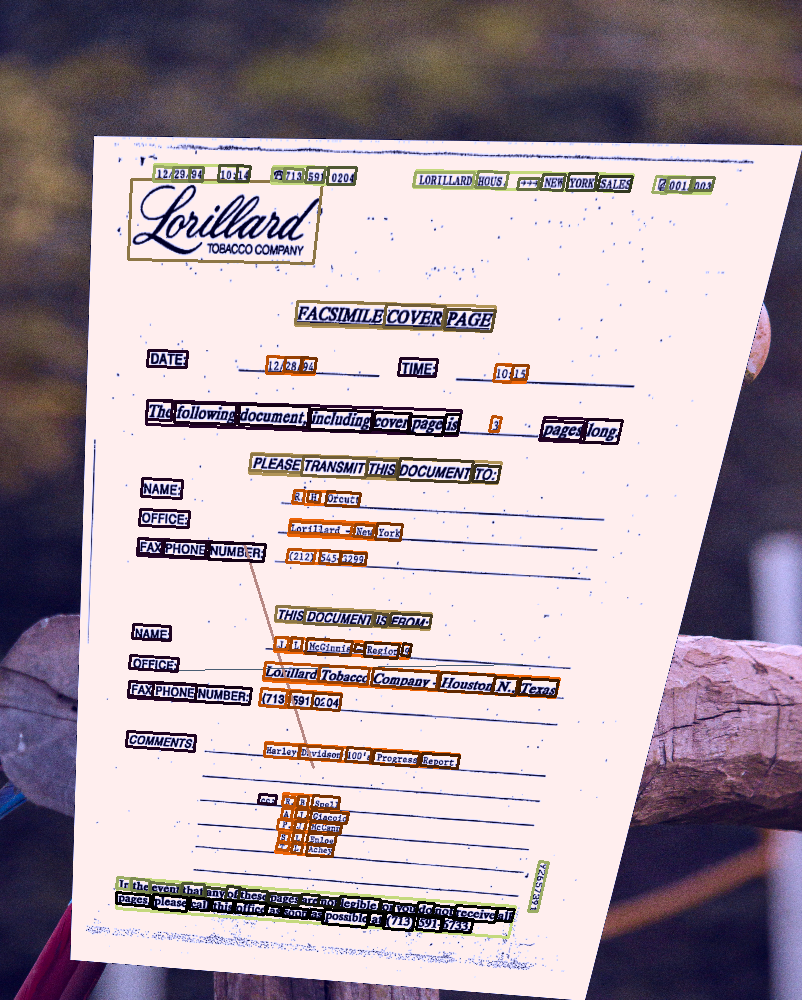

# FUNSD-polygon-dataset
This tool generates an augmented, polygon-based, dataset from the [Form Understanding in Noisy Scanned Documents](https://guillaumejaume.github.io/FUNSD/) dataset.

The resulting dataset will contain the same annotations, but the images will be augmented with a set of transformations such as perspective, brightness, contrast, etc. Plus adding random lines and "reflections".

The idea is to generate a dataset that mimics real world images taken by users with their mobile phones, instead of an scanned document dataset. For that, this dataset's annotations are polygon-based, instead of the usual bounding boxes. This means that instead of having two coordinates, we have four.

A more detailed description of the annotation properties can be found [here](docs/dataset.md).

## How to use
### Requirements
Install the requirements with `pip install -r requirements.txt`

### Download the dataset
Run `download_FUNSD.py` to download the dataset. This will download the dataset to the `datasets` folder.

### Transform coordinates to polygons
Run `coord-to-poly.py` to generate the polygon-based annotations. This will generate a new folder called `datasets/FUNSD_polygon`.

### Generate the augmented dataset
Run `main.py` to generate the augmented dataset. This will generate a new folder called `datasets/FUNSD_polygon_augmented`.

An optional parameter `--multiplier` is available to control the number of augmented images that will be generated for each input image. Defaults to 5.